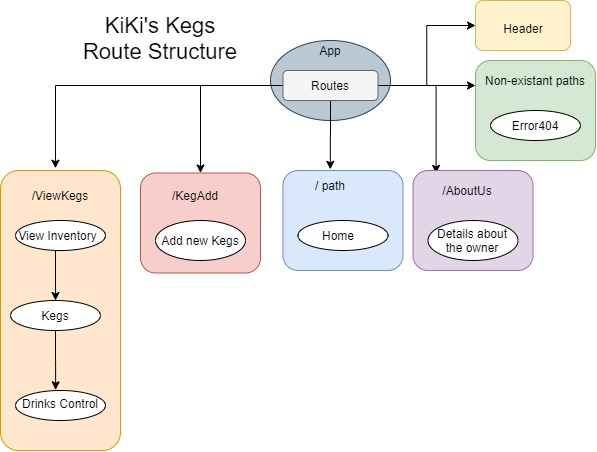

# Kiki's Keg House
### By Joseph Tubridy

## Description

This is a react applcation that displays and tracks the beverages available at a tap house.  It was created to practice using state.

## Specs
```bash

```
## Setup/Installation Requirements
```bash
1. Clone this repository.
2. Type "npm install" in your console.
3. Type "npm run start" in your console.
4. Navigate to https://localhost:8080/ in your browser.
```

## Known Bugs

While one can add kegs, and count the number of drinks left.  If they leave then return to view the kegs, the drink counters will have reset.

## Technologies Used
```bash
-JavaScript
-React
-webpack
-npm
```

### License

*This is licensed under the MIT License.*

Copyright (c) 2019 **_Joseph Tubridy_**
