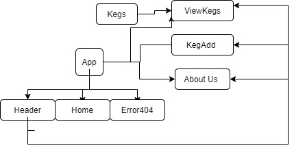

# Kiki's Keg House
### By Joseph Tubridy

## Description
*  _This is a Web app that displays and tracks the beverages available at a tap house._

## Specs

## Setup/Installation Requirements

* _Clone this repository._
* _Type "npm install" in your console._
* _Type "npm run start" in your console._
* _Navigate to https://localhost:8080/ in your browser._

## Known Bugs

_Currently one can only navigate between pages, there is no functionality to create, edit, or delete kegs.
It is also very ugly, I will fix this!_

## Technologies Used

* _JavaScript_
* _React_
* _webpack_
* _npm_

### License

*This is licensed under the MIT License.*

Copyright (c) 2019 **_Joseph Tubridy_**
